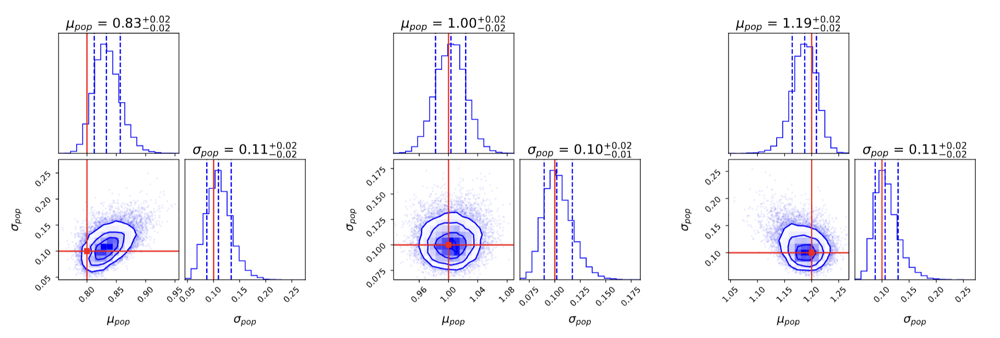

My research focus is very vast but in essence I touch and play with anything that revolves around data science, statistics and machine learning to uncover hidden truth about dark matter!! 

---

**Hierarchical bayesian inference: constraining population distribution of dark matter halo shapes via stellar streams**  

Stellar streams, the remnants of disrupted satellite systems, trace the gravitational potential of their host galaxies and thus serve as valuable probes of dark matter halo properties. While six-dimensional phase-space information enables precise halo modelling in the Milky Way, extragalactic streams lack such mesurements, severely limiting individual constraints. We present a hierarchical Bayesian framework that leverages ensembles of external stellar streams with no kinematic observations to statistically infer the population level distribution of dark matter halo flattening parameters. Using mock stream tracks generated via \texttt{JAX} accelerated particle-spray simulations, we perform individual stream fits and combine their posterior distributions through hierarchical inference. We demonstrate that 50 photometric only projected streams are sufficient to constrain the flattening of the dark matter halo and distingish between oblate, spherical, and prolate halo populations. Our method is robust to degeneracies in individual fits and the total inference time scales linearly with sample size. These results highlight the power of photometric stellar stream ensembles to constrain dark matter halo shapes without any kinematic information, opening a path toward population level dark matter inference with upcoming surveys such as \textttt{Euclid} and \textttt{LSST}. 

)

---

**Galaxies OBserved as Low-luminosity Identified Nebulae (GOBLIN): a catalog of 43,000 high-probability dwarf galaxy candidates in the UNIONS survey**

The detection of low surface brightness galaxies beyond the Local Group poses significant observational challenges, yet these faint systems are fundamental to our understanding of dark matter, hierarchical galaxy formation, and cosmic structure. Their abundance and distribution provide crucial tests for cosmological models, particularly regarding the small-scale predictions of $\Lambda$CDM. We present a systematic detection and classification framework for unresolved dwarf galaxy candidates in the large-scale Ultraviolet Near Infrared Optical Northern Survey (UNIONS) imaging data. The main survey region covers 4,861\,deg$^{2}$. Our pipeline preprocesses UNIONS data in three (\emph{gri}) of the five bands (\emph{ugriz}), including binning, artifact removal, and stellar masking before employing the software \textsc{MTObjects} (\textsc{MTO}) to detect low surface brightness objects. After parameter cuts using known dwarf galaxies from the literature and cross-matching between the three bands, we are left with an average of $\sim$360\,candidates per deg$^{2}$. With $\sim$4,000\,deg$^{2}$ in \emph{g}, \emph{r} and \emph{i}, this amounts to $\sim$1.5\,million candidates. For the final classification of these candidates, we fine-tuned the deep learning model Zoobot which was trained based on labels from the Galaxy Zoo project. We created our training dataset by visually inspecting dwarf galaxy candidates from existing literature catalogs within our survey area, and assigning probability labels based on averaged expert assessments. This approach captures both consensus and uncertainty among experts. Applied to all detected \textsc{MTO} objects, our method identifies 23,340 dwarf galaxy candidates with probability scores > 0.8, of which 7,906 have probabilities exceeding 0.9. The spatial distribution of high-probability candidates reveals a correlation with the locations of massive galaxies (log\,$(M_{*}/M_\odot) \geq$ 10) within 120\,Mpc. While some of these objects may have been previously identified in other surveys, we present this extensive catalog of candidates, including their positions, structural parameter estimates, and classification probabilities, as a resource for the community to enable studies of galaxy formation, evolution, and the distribution of dwarf galaxies in different environments.

